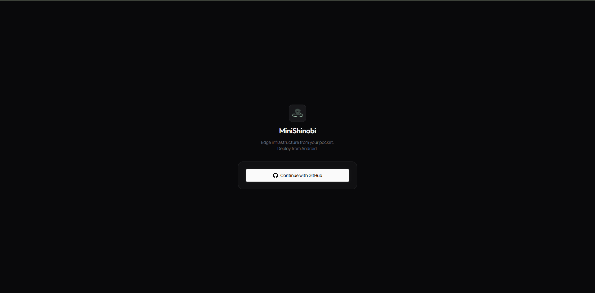
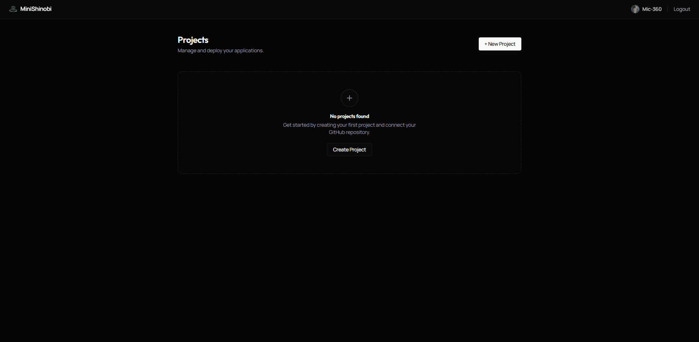
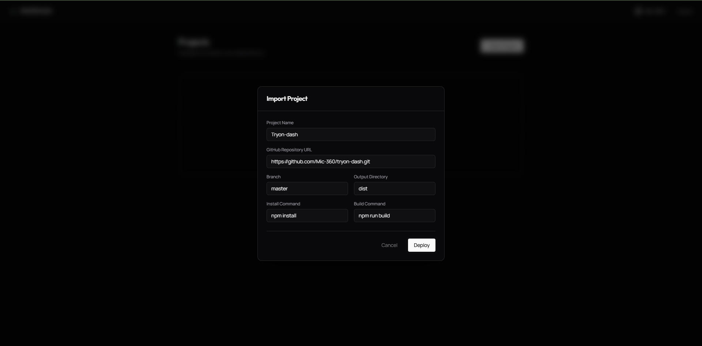
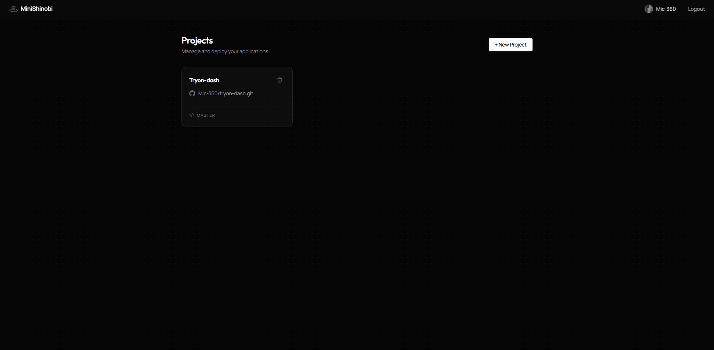
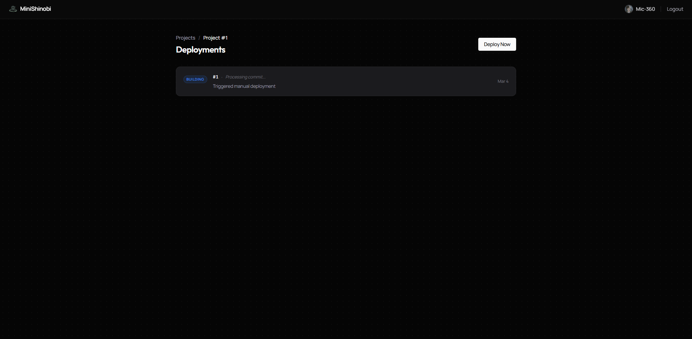
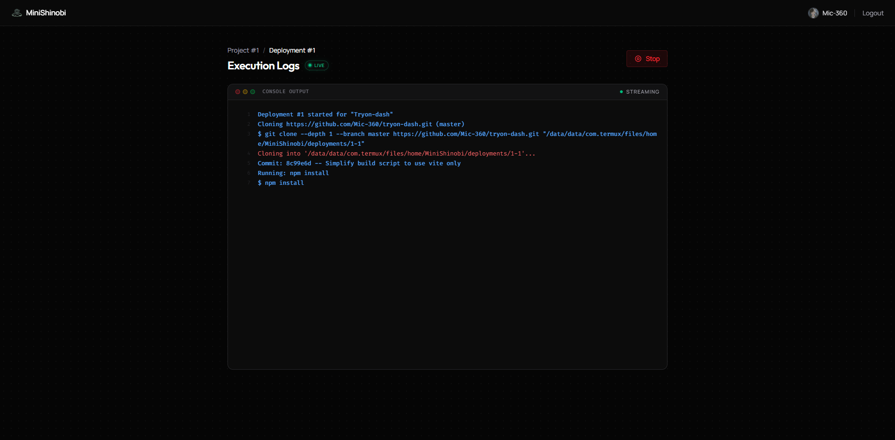
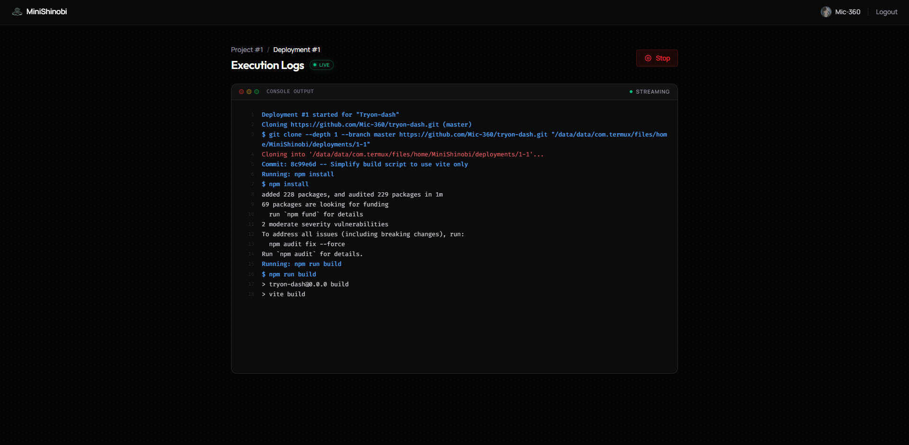

<p align="center">
  
</p>

<h1 align="center">MiniShinobi</h1>
<p align="center">
  <strong>Self-hosted micro-PaaS for Git-based deployments on low-resource devices.</strong>
</p>

<p align="center">
  <a href="#overview">Overview</a> •
  <a href="#architecture">Architecture</a> •
  <a href="#prerequisites">Prerequisites</a> •
  <a href="#installation">Installation</a> •
  <a href="#configuration">Configuration</a> •
  <a href="#deployment-flows">Deployment Flows</a> •
  <a href="#api-reference">API Reference</a> •
  <a href="#troubleshooting">Troubleshooting</a>
</p>

---

## Overview

MiniShinobi is a lightweight, self-hosted deployment platform designed to run on resource-constrained devices like phones running Termux, as well as any standard Linux server. It gives you a personal PaaS (Platform as a Service) — push code to GitHub, and MiniShinobi clones it, builds it, runs it, and exposes it on the internet via a Cloudflare Tunnel.

**What it does:**

- Provides a React dashboard to create projects, trigger deployments, and stream live logs
- Accepts GitHub-style webhook events to auto-deploy on every push
- Clones your repository, detects the framework, runs the build, and starts the process
- Manages isolated child processes for each app with automatic port assignment
- Generates per-app Nginx virtual host configs and reloads Nginx automatically
- Exposes every deployed app at `<project-name>.<your-domain>` via Cloudflare Tunnel
- Persists deployment history and logs in SQLite (via `sql.js` — no native binaries)

**Design goals:**

- Zero native compilation: uses `sql.js` (WebAssembly SQLite), `session-file-store`, and Node.js built-in `child_process`
- Works on 4 GB RAM · ARM devices without any native `node-gyp` dependencies
- One backend process manages all deployed apps via in-process child spawning

---

## Architecture

```text
Internet
    └──> Cloudflare (DNS + proxy)
            └──> cloudflared tunnel (authenticated tunnel to your device)
                    └──> Nginx on port 80 (host-based virtual routing)
                            ├──> dashboard.<domain>  ──> MiniShinobi backend (port 3000)
                            │                              ├── serves built React frontend
                            │                              ├── REST API (/api/...)
                            │                              └── POST /deploy (webhook)
                            └──> <app>.<domain>      ──> spawned app process (port 5000–5999)
```

### Runtime Model

| Component                          | Description                                                                           |
| ---------------------------------- | ------------------------------------------------------------------------------------- |
| **Backend** (`backend/src/app.js`) | Single Express 5 server. Initialises SQLite, registers routes, serves the React build |
| **Deployer** (`src/deployer.js`)   | In-process deployment queue. Serialises builds so only one runs at a time             |
| **Deployment Controller**          | Orchestrates: git → build → port → process → nginx → registry                         |
| **Process Manager**                | Maintains an in-memory `Map` of running `child_process` handles per project           |
| **Runtime Registry**               | `/runtime/projects.json` — JSON file tracking every app's status, port, PID, etc.     |
| **Nginx Manager**                  | Writes per-project `.conf` files to `nginx/sites-enabled/` and reloads Nginx          |
| **SQLite (sql.js)**                | Stores users, projects, deployments, and streaming logs. Saved to disk every 5 s      |

---

## Prerequisites

### All Platforms

| Requirement         | Version           | Purpose                               |
| ------------------- | ----------------- | ------------------------------------- |
| Node.js             | 18 LTS or newer   | Backend + build tooling               |
| npm                 | bundled with Node | Package installation                  |
| Git                 | any recent        | Cloning and pulling app repos         |
| Nginx               | any recent        | Reverse proxy / virtual host routing  |
| cloudflared         | any recent        | Cloudflare Tunnel (internet exposure) |
| PM2 _(recommended)_ | any               | Process supervision and auto-restart  |

### Termux (Android)

Open Termux and install everything with:

```bash
pkg update && pkg upgrade -y
pkg install nodejs-lts git nginx cloudflared -y
npm install -g pm2
```

> **Note:** On Termux, all binary paths live under `/data/data/com.termux/files/usr/bin/`. The included `ecosystem.config.js` already uses these paths.

### Standard Linux (Ubuntu/Debian)

```bash
# Node.js 20 LTS
curl -fsSL https://deb.nodesource.com/setup_20.x | sudo -E bash -
sudo apt-get install -y nodejs git nginx

# cloudflared
curl -L https://github.com/cloudflare/cloudflared/releases/latest/download/cloudflared-linux-amd64.deb -o cloudflared.deb
sudo dpkg -i cloudflared.deb

# PM2
npm install -g pm2
```

---

## Installation

### 1. Clone the Repository

```bash
git clone https://github.com/Mic-360/MiniShinobi.git
cd MiniShinobi
```

### 2. Install Dependencies

```bash
# Backend
cd backend && npm install && cd ..

# Frontend
cd frontend && npm install && cd ..
```

### 3. Create Required Directories

```bash
mkdir -p apps runtime/logs nginx/sites-enabled logs
```

| Directory              | Purpose                                                        |
| ---------------------- | -------------------------------------------------------------- |
| `apps/`                | Git clones of your deployed projects land here                 |
| `runtime/`             | `projects.json` runtime registry and per-app process logs      |
| `runtime/logs/`        | Individual `<project>.log` files for running app stdout/stderr |
| `nginx/sites-enabled/` | Auto-generated per-project Nginx vhost configs                 |
| `logs/`                | PM2 backend/nginx/tunnel log output                            |

### 4. Configure the Backend

```bash
cp backend/.env.example backend/.env
```

Open `backend/.env` and fill in all values. See the [Configuration](#configuration) section for what each variable does.

### 5. Build the Frontend

The backend serves the React frontend as static files from `frontend/dist`. You must build it before starting:

```bash
cd frontend
npm run build
cd ..
```

The `frontend/dist` folder is served automatically by the backend. You do not need a separate web server for the dashboard.

### 6. Configure Nginx

MiniShinobi generates per-project Nginx vhost files in `nginx/sites-enabled/`. Your main Nginx config just needs to include them.

Edit `nginx/nginx.conf` (or your system nginx.conf) and make sure it contains an `include` directive like:

```nginx
# Termux path — adjust for your setup
include /data/data/com.termux/files/home/MiniShinobi/nginx/sites-enabled/*.conf;
```

For standard Linux, this might be:

```nginx
include /home/<user>/MiniShinobi/nginx/sites-enabled/*.conf;
```

**Verify the config and start Nginx:**

```bash
nginx -t                         # test config
nginx -c /path/to/nginx/nginx.conf   # start with custom config
# or reload if already running:
nginx -s reload
```

### 7. Authenticate cloudflared

If you haven't already, log in and create a tunnel:

```bash
cloudflared tunnel login
cloudflared tunnel create minishinobi-dashboard
```

Copy the credentials file UUID printed by the command. You'll need it in the next step.

### 8. Configure the Cloudflare Tunnel

Edit `cloudflared/config.yml` (or `~/.cloudflared/config.yml`):

```yaml
tunnel: <your-tunnel-uuid>
credentials-file: /path/to/.cloudflared/<uuid>.json

ingress:
  - hostname: dashboard.yourdomain.com
    service: http://localhost:80
  - hostname: '*.yourdomain.com'
    service: http://localhost:80
  - service: http_status:404
```

Both the dashboard and all `<app>.yourdomain.com` subdomains route through Nginx on port 80. Nginx then proxies to the correct backend port.

Add DNS records in Cloudflare for `dashboard.yourdomain.com` and `*.yourdomain.com`, pointing them to the tunnel (Cloudflare will create these automatically if you use `cloudflared tunnel route dns`).

### 9. Start Everything with PM2

The included `ecosystem.config.js` starts the backend, Nginx, and the Cloudflare Tunnel as three supervised processes.

> **Termux users:** The file uses Termux-specific binary and path locations. Review and update paths if you are on standard Linux.

```bash
pm2 start ecosystem.config.js
pm2 status
pm2 save          # persist across reboots
pm2 startup       # (Linux) generate startup script
```

Expected output:

```
┌─────────────────────────┬─────────┬──────┬───────┐
│ name                    │ status  │ cpu  │ mem   │
├─────────────────────────┼─────────┼──────┼───────┤
│ minishinobi-backend     │ online  │ 0%   │ ~60mb │
│ minishinobi-nginx       │ online  │ 0%   │ ~5mb  │
│ minishinobi-tunnel      │ online  │ 0%   │ ~30mb │
└─────────────────────────┴─────────┴──────┴───────┘
```

Open `https://dashboard.yourdomain.com` in your browser. You should see the MiniShinobi login page.

---

## Configuration

All backend configuration is done via `backend/.env`. The server will not start without the required variables.

### Full Variable Reference

| Variable                  | Required | Default                              | Description                                                                                                                                                                              |
| ------------------------- | -------- | ------------------------------------ | ---------------------------------------------------------------------------------------------------------------------------------------------------------------------------------------- |
| `PORT`                    | No       | `3000`                               | Port the backend process listens on (binds to `127.0.0.1` only)                                                                                                                          |
| `NODE_ENV`                | No       | —                                    | Set to `production` for secure cookies and production behaviour                                                                                                                          |
| `SESSION_SECRET`          | **Yes**  | —                                    | Random string used to sign session cookies. Use a long random value                                                                                                                      |
| `DASHBOARD_URL`           | **Yes**  | —                                    | Full URL of your dashboard, e.g. `https://dashboard.yourdomain.com`. Used by CORS and OAuth redirect                                                                                     |
| `GITHUB_CLIENT_ID`        | **Yes**  | —                                    | OAuth App client ID from GitHub                                                                                                                                                          |
| `GITHUB_CLIENT_SECRET`    | **Yes**  | —                                    | OAuth App client secret from GitHub                                                                                                                                                      |
| `GITHUB_CALLBACK_URL`     | **Yes**  | —                                    | Must exactly match the callback URL in your GitHub OAuth App, e.g. `https://dashboard.yourdomain.com/auth/github/callback`                                                               |
| `DB_PATH`                 | **Yes**  | —                                    | Absolute path to the SQLite file, e.g. `/home/user/MiniShinobi/runtime/db.sqlite`. The directory is created automatically. Sessions are stored in a `sessions/` folder next to this file |
| `LOGS_DIR`                | No       | —                                    | Path for platform-level logs (used for reference; PM2 manages log files directly via `ecosystem.config.js`)                                                                              |
| `APPS_DIR`                | No       | `<project-root>/apps`                | Where cloned repositories are stored. Each project gets a subdirectory named after its slug                                                                                              |
| `RUNTIME_DIR`             | No       | `<project-root>/runtime`             | Root of the runtime metadata directory. Contains `projects.json` and `logs/`                                                                                                             |
| `BASE_DOMAIN`             | No       | `minishinobi.dev`                    | Subdomain suffix for deployed apps. If set to `yourdomain.com`, a project named `blog` becomes `blog.yourdomain.com`                                                                     |
| `NGINX_SITES_ENABLED_DIR` | No       | `<project-root>/nginx/sites-enabled` | Where generated per-project Nginx `.conf` files are written                                                                                                                              |
| `NGINX_RELOAD_CMD`        | No       | `nginx -s reload`                    | Command to reload Nginx after a vhost config changes                                                                                                                                     |
| `WEBHOOK_SECRET`          | **Yes**  | —                                    | HMAC-SHA256 secret shared with GitHub (or any webhook source). Used to verify `POST /deploy` requests                                                                                    |
| `APP_PORT_START`          | No       | `5000`                               | Start of the port range for deployed app processes                                                                                                                                       |
| `APP_PORT_END`            | No       | `5999`                               | End of the port range. MiniShinobi scans this range and picks the first free port                                                                                                        |

### Example `.env`

```dotenv
PORT=3000
NODE_ENV=production
SESSION_SECRET=change-me-to-a-long-random-string

DASHBOARD_URL=https://dashboard.yourdomain.com
GITHUB_CLIENT_ID=Ov23liXXXXXXXXXX
GITHUB_CLIENT_SECRET=abc123...
GITHUB_CALLBACK_URL=https://dashboard.yourdomain.com/auth/github/callback

DB_PATH=/home/user/MiniShinobi/runtime/db.sqlite

BASE_DOMAIN=yourdomain.com
NGINX_SITES_ENABLED_DIR=/home/user/MiniShinobi/nginx/sites-enabled
NGINX_RELOAD_CMD=nginx -s reload

WEBHOOK_SECRET=another-long-random-string

APP_PORT_START=5000
APP_PORT_END=5999
```

### Creating a GitHub OAuth App

1. Go to **GitHub → Settings → Developer Settings → OAuth Apps → New OAuth App**
2. Set **Homepage URL** to `https://dashboard.yourdomain.com`
3. Set **Authorization callback URL** to `https://dashboard.yourdomain.com/auth/github/callback`
4. Copy the **Client ID** and generate a **Client Secret**
5. Paste both into `backend/.env`

---

## Deployment Flows

### A) Dashboard Deployment

This is the standard flow for projects you create and manage in the UI.

1. Log in at `https://dashboard.yourdomain.com`
2. Click **New Project** and fill in the repository URL, branch, and optional build/start commands
3. Click **Deploy** on the project card
4. Watch live deployment logs stream in real time

Internally:

1. `POST /api/deployments/project/:projectId/deploy` creates a `queued` deployment record
2. The deployment enters the global serial queue in `deployer.js`
3. `deploymentController.executeDeployment` runs: git → build → process → nginx
4. Status updates flow to the frontend via SSE (`GET /api/deployments/:id/logs`)

### B) Webhook Deployment

Use this to auto-deploy when you push to GitHub.

**Set up the webhook in GitHub:**

1. Go to your repository → **Settings → Webhooks → Add webhook**
2. Set **Payload URL** to `https://dashboard.yourdomain.com/deploy`
3. Set **Content type** to `application/json`
4. Set **Secret** to the same value as your `WEBHOOK_SECRET` env variable
5. Choose **Just the push event** (or specific events)
6. Save

**How it works:**

GitHub sends a `POST /deploy` request with an `x-hub-signature-256` header. MiniShinobi verifies the HMAC signature against `WEBHOOK_SECRET` using constant-time comparison. If valid, it resolves the project from the repository URL and queues a deployment.

If the project doesn't exist yet in the database, MiniShinobi creates it automatically using the repository name as the slug.

**Manual webhook request (for testing):**

```bash
PAYLOAD='{"repository":{"clone_url":"https://github.com/your-org/your-repo.git"},"ref":"refs/heads/main"}'
SIG=$(echo -n "$PAYLOAD" | openssl dgst -sha256 -hmac "your-webhook-secret" | awk '{print "sha256="$2}')

curl -X POST https://dashboard.yourdomain.com/deploy \
  -H "Content-Type: application/json" \
  -H "x-hub-signature-256: $SIG" \
  -d "$PAYLOAD"
```

Expected response:

```json
{ "deploymentId": 42, "status": "queued" }
```

> The webhook also accepts `x-minishinobi-signature` as an alternative header name.

### C) Deployment Pipeline (both flows)

Every deployment, regardless of trigger, runs through the same pipeline:

```
1. Mark deployment as "building" in DB
2. git clone (first deploy) OR git fetch + checkout + pull (redeploy)
3. Read commit SHA and message
4. Read .minishinobi.json if it exists
5. Detect framework (or use project's saved commands)
6. Resolve final build command and start command
7. Run build command in a shell (stdout/stderr streamed to SSE and saved to DB)
8. Allocate port (reuse existing port if project was previously deployed)
9. Stop old process (SIGTERM → 10s → SIGKILL) and start new one
10. Write nginx vhost config; reload nginx only if config changed
11. Update runtime registry (runtime/projects.json)
12. Mark deployment as "ready" in DB with tunnel_url
13. Emit [END] to SSE clients
```

If any step fails, the deployment is marked as `failed` with the error message, and `[END]` is still emitted.

---

## Framework Detection

When a project has no custom commands set (or `.minishinobi.json` is absent), MiniShinobi auto-detects frameworks by checking config files first (including TypeScript variants), then `package.json` dependencies.

### Supported frameworks

- `next`
- `nuxt`
- `remix`
- `astro`
- `sveltekit`
- `vite`
- `node`
- `static`

### Config file detection matrix

| Framework    | Config files checked |
| ------------ | -------------------- |
| `next`       | `next.config.js`, `next.config.mjs`, `next.config.cjs`, `next.config.ts`, `next.config.mts`, `next.config.cts` |
| `nuxt`       | `nuxt.config.js`, `nuxt.config.mjs`, `nuxt.config.cjs`, `nuxt.config.ts`, `nuxt.config.mts`, `nuxt.config.cts` |
| `remix`      | `remix.config.js`, `remix.config.mjs`, `remix.config.cjs`, `remix.config.ts`, `remix.config.mts`, `remix.config.cts` |
| `astro`      | `astro.config.js`, `astro.config.mjs`, `astro.config.cjs`, `astro.config.ts`, `astro.config.mts`, `astro.config.cts` |
| `sveltekit`  | `svelte.config.js`, `svelte.config.mjs`, `svelte.config.cjs`, `svelte.config.ts`, `svelte.config.mts`, `svelte.config.cts` (requires `@sveltejs/kit`) |
| `vite`       | `vite.config.js`, `vite.config.mjs`, `vite.config.cjs`, `vite.config.ts`, `vite.config.mts`, `vite.config.cts` |

If no config match exists, dependency fallback is used:

- `next` dependency -> `next`
- `nuxt` dependency -> `nuxt`
- `@remix-run/node` or `@remix-run/react` -> `remix`
- `astro` dependency -> `astro`
- `@sveltejs/kit` dependency -> `sveltekit`
- any `package.json` -> `node`
- `index.html` without `package.json` -> `static`

### Preset commands

| Framework   | Build Command                  | Start Command    |
| ----------- | ------------------------------ | ---------------- |
| `next`      | `npm install && npm run build` | `npm start`      |
| `nuxt`      | `npm install && npm run build` | `npm run start`  |
| `remix`     | `npm install && npm run build` | `npm run start`  |
| `astro`     | `npm install && npm run build` | `npx serve dist` |
| `sveltekit` | `npm install && npm run build` | `npm run preview` |
| `vite`      | `npm install && npm run build` | `npx serve dist` |
| `node`      | `npm install`                  | `npm start`      |
| `static`    | _(none)_                       | `npx serve .`    |

### Command priority

Commands are resolved in this priority order (highest wins):

1. **`.minishinobi.json`** in the repository root — highest priority, overrides everything
2. **Project custom commands** — set via `POST /api/projects` with `install_command`, `build_command`, `start_command`, or `output_dir`
3. **Auto-detected framework preset** — fallback when nothing else is set

If you set an `output_dir` (for example `build`) but no `start_command`, the start command becomes `npx serve <output_dir>`.

---

## `.minishinobi.json`

Place this file in the root of your repository to override build and start commands for that specific project:

```json
{
  "build": "npm install && npm run build:prod",
  "start": "node dist/server.js"
}
```

| Field   | Description                                                                |
| ------- | -------------------------------------------------------------------------- |
| `build` | Shell command to install dependencies and build the project                |
| `start` | Shell command to start the application. Receives `PORT` as an env variable |

Both fields are optional. Omitting `build` skips the build phase. Omitting `start` falls back to the framework preset.

The `PORT` environment variable is always injected into the start process — your app must listen on `process.env.PORT`.

---

## API Reference

All `/api/*` routes require authentication (GitHub OAuth session). Public routes are available for deploy and runtime control: `/deploy`, `/apps`, and `/logs/:project`.

### Authentication

| Method | Path                    | Description                                                                                   |
| ------ | ----------------------- | --------------------------------------------------------------------------------------------- |
| `GET`  | `/auth/github`          | Redirects to GitHub OAuth flow                                                                |
| `GET`  | `/auth/github/callback` | OAuth callback — redirects to dashboard on success                                            |
| `GET`  | `/auth/me`              | Returns `{ id, username, avatar_url }` for the logged-in user. Returns `401` if not logged in |
| `POST` | `/auth/logout`          | Destroys the session. Returns `{ ok: true }`                                                  |

### Projects

All project routes are scoped to the authenticated user. Users cannot access each other's projects.

| Method   | Path                | Description                                                      |
| -------- | ------------------- | ---------------------------------------------------------------- |
| `GET`    | `/api/projects`       | List all projects for the current user, ordered by creation date |
| `GET`    | `/api/projects/repos` | List repositories available from the authenticated GitHub account |
| `POST`   | `/api/projects`       | Create a new project and automatically create/update push webhook |
| `DELETE` | `/api/projects/:id`   | Delete a project and all its data                                |

**`POST /api/projects` body:**

```json
{
  "name": "my-blog",
  "repo_url": "https://github.com/you/my-blog.git",
  "branch": "main",
  "install_command": "npm install",
  "build_command": "npm run build",
  "output_dir": "dist",
  "start_command": "node server.js",
  "framework": "vite"
}
```

Only `name` and `repo_url` are required. The `name` is slugified to generate the project subdomain. For example, `"My Blog"` becomes `my-blog.yourdomain.com`.

When creating a project, MiniShinobi also attempts to auto-create (or update) a GitHub push webhook pointing to your `/deploy` endpoint.

Returns `409 Conflict` if a project with that slug already exists under your account.

### Deployments

| Method   | Path                                         | Description                                                                                                                                                        |
| -------- | -------------------------------------------- | ------------------------------------------------------------------------------------------------------------------------------------------------------------------ |
| `GET`    | `/api/deployments/project/:projectId`        | List the 20 most recent deployments for a project                                                                                                                  |
| `POST`   | `/api/deployments/project/:projectId/deploy` | Trigger a new deployment. Returns `202 Accepted` with `{ deploymentId, status: "queued" }`                                                                         |
| `GET`    | `/api/deployments/:id`                       | Get a single deployment record                                                                                                                                     |
| `GET`    | `/api/deployments/:id/logs`                  | **SSE stream** — streams live log lines. Replays existing logs first, then pushes new lines in real time. Closed with a `[END]` event when the deployment finishes |
| `DELETE` | `/api/deployments/:id`                       | Cancel a queued deployment, or stop the running deployment and its process                                                                                         |

**SSE log event format:**

```json
{
  "stream": "stdout",
  "message": "Build succeeded",
  "ts": "2026-03-05T12:00:00.000Z"
}
```

`stream` is one of `stdout`, `stderr`, or `system`.

### Deploy (Webhook + CLI)

| Method | Path      | Description |
| ------ | --------- | ----------- |
| `POST` | `/deploy` | Trigger a deployment. Supports webhook mode (`repository.clone_url`) and CLI mode (`repo`). |

Webhook mode expects HMAC signature (`x-hub-signature-256` or `x-minishinobi-signature`).

CLI mode accepts:

```json
{
  "repo": "https://github.com/user/repo.git",
  "ref": "refs/heads/main"
}
```

If `WEBHOOK_SECRET` is set, include `x-minishinobi-secret` in CLI deploy requests.

### Runtime Control (CLI endpoints)

| Method   | Path                     | Description |
| -------- | ------------------------ | ----------- |
| `GET`    | `/apps`                  | List runtime apps from `runtime/projects.json` |
| `GET`    | `/logs/:project`         | Stream latest deployment logs (SSE) |
| `POST`   | `/apps/:project/restart` | Restart project process |
| `POST`   | `/apps/:project/stop`    | Stop project process |
| `DELETE` | `/apps/:project`         | Stop process, remove app dir, remove nginx config, reload nginx |

### Health

| Method | Path      | Description                                                                        |
| ------ | --------- | ---------------------------------------------------------------------------------- |
| `GET`  | `/health` | Returns `{ ok: true, ts: <unix-ms> }`. Use this to check if the backend is running |

---

## Runtime Registry

`runtime/projects.json` is a JSON file that acts as the live state of every deployed project. It is read and written directly by the process manager and deployment controller.

**Example:**

```json
{
  "my-blog": {
    "name": "my-blog",
    "path": "/home/user/MiniShinobi/apps/my-blog",
    "port": 5001,
    "host": "my-blog.yourdomain.com",
    "status": "running",
    "pid": 14872,
    "framework": "vite",
    "buildCommand": "npm install && npm run build",
    "startCommand": "npx serve dist",
    "repoUrl": "https://github.com/you/my-blog.git",
    "branch": "main",
    "deploymentId": 7,
    "updatedAt": "2026-03-05T12:00:00.000Z",
    "createdAt": "2026-03-05T11:30:00.000Z"
  }
}
```

**Possible `status` values:**

| Status     | Meaning                                                     |
| ---------- | ----------------------------------------------------------- |
| `building` | Deployment is currently running the build step              |
| `starting` | Process was spawned, waiting for it to stabilize (1 second) |
| `running`  | Process is live and serving traffic                         |
| `stopped`  | Process was cleanly stopped (exit code 0 or SIGTERM)        |
| `crashed`  | Process exited unexpectedly with a non-zero exit code       |
| `failed`   | The deployment pipeline failed before the process started   |

If `runtime/projects.json` becomes corrupt, a backup is saved automatically as `projects.json.corrupt.<timestamp>` and an empty registry is used.

---

## Database Schema

MiniShinobi uses SQLite via `sql.js`. The database is loaded into memory at startup, and written to disk at `DB_PATH` every 5 seconds and on clean shutdown (SIGINT/SIGTERM).

```
users          — GitHub OAuth user accounts
projects       — deployment targets (one per repo per user)
deployments    — individual deployment runs with status, commit info, port, pid
logs           — streamed stdout/stderr/system lines for each deployment
```

See [`backend/db/schema.sql`](backend/db/schema.sql) for the full schema.

---

## Repository Structure

```text
MiniShinobi/
├── ecosystem.config.js        # PM2 process definitions (backend + nginx + cloudflared)
├── backend/
│   ├── package.json
│   ├── .env                   # your environment variables (not committed)
│   ├── db/
│   │   └── schema.sql         # SQLite schema (users, projects, deployments, logs)
│   └── src/
│       ├── app.js             # Express app bootstrap, session, passport, routing
│       ├── deployer.js        # Deployment queue, SSE broadcast hub
│       ├── db.js              # sql.js database init and disk-save logic
│       ├── dbHelpers.js       # Synchronous prepare/get/all/run helpers over sql.js
│       ├── portManager.js     # Port range scanner (APP_PORT_START – APP_PORT_END)
│       ├── controllers/
│       │   └── deploymentController.js  # Full deployment pipeline orchestration
│       ├── routes/
│       │   ├── auth.js        # GET /auth/github, /auth/me, POST /auth/logout
│       │   ├── deploy.js      # POST /deploy (webhook with HMAC verification)
│       │   ├── deployments.js # CRUD + SSE log streaming for deployments
│       │   └── projects.js    # CRUD for projects
│       └── services/
│           ├── buildRunner.js     # Shell command runner with buffered line output
│           ├── frameworkDetector.js  # Detects Next/Vite/Node/Static by file presence
│           ├── gitManager.js      # git clone / fetch / pull / commit info
│           ├── nginxManager.js    # Generates vhost .conf files and reloads nginx
│           ├── processManager.js  # Spawns, restarts, and stops app child processes
│           └── runtimeRegistry.js # Reads/writes runtime/projects.json
├── frontend/
│   ├── package.json
│   ├── vite.config.js
│   ├── index.html
│   └── src/
│       ├── api.js             # Axios instance configured to hit the backend
│       ├── App.jsx            # Root component with routing
│       ├── context/
│       │   └── AuthContext.jsx
│       ├── pages/
│       │   ├── Login.jsx
│       │   ├── Dashboard.jsx  # Project list and deploy buttons
│       │   ├── Project.jsx    # Project detail and deployment history
│       │   └── Deployment.jsx # Live SSE log viewer
│       └── components/
│           ├── Layout.jsx
│           └── ui/            # Button, Input, Badge, Modal
├── nginx/
│   ├── nginx.conf             # Main nginx configuration
│   └── sites-enabled/        # Auto-generated per-project vhost configs (gitignored)
├── cloudflared/
│   └── config.yml             # cloudflared tunnel configuration
├── apps/                      # Cloned project repositories (gitignored)
├── runtime/                   # projects.json + per-app logs (gitignored)
└── logs/                      # PM2 process output logs (gitignored)
```

## Visual Workflow

| Step 1: Login | Step 2: Dashboard |
| :---: | :---: |
|  |  |
| **Authentication via GitHub OAuth** | **Overview of all your projects** |

| Step 3: Create Project | Step 4: Configure |
| :---: | :---: |
|  |  |
| **Add a new repository** | **Setup build and install commands** |

| Step 5: Build Logs | Step 6: Ready |
| :---: | :---: |
|  |  |
| **Real-time deployment monitoring** | **Successful deployment status** |

| Step 7: Live App |
| :---: |
|  |
| **Your project live on your domain** |

<br />

## Troubleshooting

### Backend won't start

- Check that all required env variables in `backend/.env` are set
- Ensure `DB_PATH` directory is writable
- Run `node backend/src/app.js` directly to see the full error output
- Check `logs/backend-error.log` if running under PM2

### Dashboard is blank or shows a 404

- Confirm you ran `npm run build` in the `frontend/` directory
- The `frontend/dist/` folder must exist — the backend serves it as static files
- Verify `DASHBOARD_URL` in `.env` matches exactly what you're accessing in the browser (no trailing slash)

### GitHub OAuth login fails

- Verify `GITHUB_CLIENT_ID` and `GITHUB_CLIENT_SECRET` are correct
- Verify `GITHUB_CALLBACK_URL` in `.env` exactly matches the callback URL set in the GitHub OAuth App (including `https://`)
- Check that `SESSION_SECRET` is set — sessions will not work without it

### Webhook returns 401

- Confirm `WEBHOOK_SECRET` in `.env` matches the secret set in the GitHub webhook settings
- Ensure `Content type` is set to `application/json` in the GitHub webhook config
- GitHub sends the signature over the raw request body — do not modify or re-encode the payload

### App deploys but is not reachable

1. Check `runtime/projects.json` — confirm the project's `status` is `running` and note the `port`
2. Test the app locally: `curl http://127.0.0.1:<port>`
3. Check `nginx/sites-enabled/<project>.conf` — confirm it was generated with the correct port
4. Run `nginx -t` to validate the Nginx config, then `nginx -s reload`
5. Check the Cloudflare Tunnel dashboard to ensure the wildcard DNS record exists for `*.<yourdomain.com>`
6. Check `runtime/logs/<project>.log` for app-level errors

### Build fails

- Open the deployment in the dashboard and read the SSE log stream
- Common causes: missing dependencies, incorrect build command, or not enough memory for the build
- Override commands using `.minishinobi.json` in your repo root
- Verify the project's `branch` is correct

### Process crashes after deploying

- Check `runtime/logs/<project>.log` for the crash reason
- Ensure your app reads `PORT` from `process.env.PORT` — MiniShinobi injects this automatically
- Verify your start command is correct (you can set it in `.minishinobi.json`)

### Out of ports

- Increase the range with `APP_PORT_START` and `APP_PORT_END` in `.env`
- Default range is `5000–5999` (1000 slots)

### Old process not stopping

MiniShinobi sends SIGTERM and waits 10 seconds before sending SIGKILL. If a process is stuck, it will be force-killed after 10 seconds automatically.

---

## License

This project is open source under the [MIT License](LICENSE).

---

<p align="center">
  <sub>Built with ❤️ by bhaumic <br />on a Snapdragon 660 · 4 GB RAM · PixelExperience Android 13</sub><br />
  <sub>Zero native compilation: sql.js + session-file-store + child_process (built-in)</sub>
</p>


